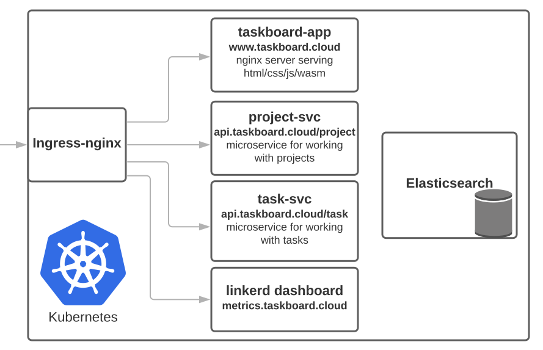

# Taskboard


[](https://crates.io/crates/taskboard-core-lib)


A Kanban inspired board for managing tasks/todo's and tracking progress.

Visit [https://www.taskboard.cloud](https://www.taskboard.cloud) to try it out!

This application is mostly a proof-of-concept of full-stack development with Rust.
It's also a nice chance for me to play with rust, docker, kubernetes and elasticsearch.

Elasticsearch might be a weird choice for persisting data.
I chose it simply to learn more about it.

## Architecture Overview

Here's a high level overview of the different services:



## Logs, Metrics and Monitoring

Basic health info is available at
[https://www.taskboard.cloud/healthz](https://www.taskboard.cloud/healthz).
More detailed metrics are password protected. LMK if you need access.

## Development

### Prerequisites

* Docker >= v20.10 and preferably docker-compose

  * To use older versions of docker you'll need to add this to the top of the
    Dockerfiles

    ```Dockerfile
    # syntax = docker/dockerfile:1-experimental
    ```

* Enable [BuildKit](https://docs.docker.com/develop/develop-images/build_enhancements/)
  for docker and docker-compose.
  This is not required, *but recommended* because it significantly speeds up
  subsequent builds due to caching.

  ```sh
  export DOCKER_BUILDKIT=1
  export COMPOSE_DOCKER_CLI_BUILD=1
  ```

### Run the code

```sh
docker-compose up -d --build
```

### Likely issues when running locally

#### Port 80 not available

docker-compose.yaml maps the nginx container serving the front-end app to
http://localhost

```yaml
ports:
  - "80:80"
```

This will fail if you already have something running on port 80.
Feel free to change it to something else.

#### Front-end app not updating

It's probably cached in the browser. Disable cache or hard-reload
(control-shift-r in chrome).
The problem is mitigated for CI builds by appending the (short) commit hash to
the file names.

#### Creating projects and tasks fails when low disk-space available

Your local elasticsearch cluster becomes read-only if you're low on disk space.
This makes creating tasks and projects fail.
The elasticsearch container will emit logs similar to this.

```json
{
  "type": "server",
  "level": "WARN",
  "component": "o.e.c.r.a.DiskThresholdMonitor",
  "cluster.name": "docker-cluster",
  "message": "flood stage disk watermark [95%] exceeded on [OZOgTVsrTlerKqoChHnhYw][3d7d5a8abd03][/usr/share/elasticsearch/data/nodes/0] free: 2.1gb[3%], all indices on this node will be marked read-only"
}
```

In my experience it was caused by docker images and build cache filling up my
root partition. These commands should help free up some space:

```console
docker system df           # check how much space docker is taking
docker image prune -a      # remove all unused images
docker build prune         # remove dangling build cache
```
